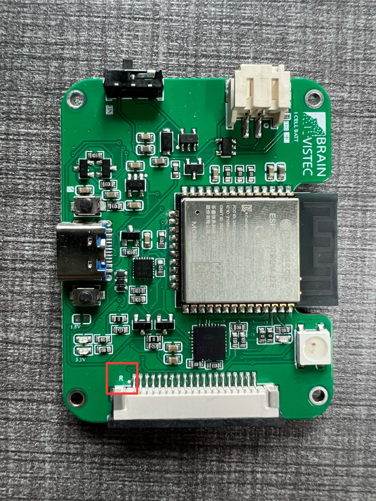
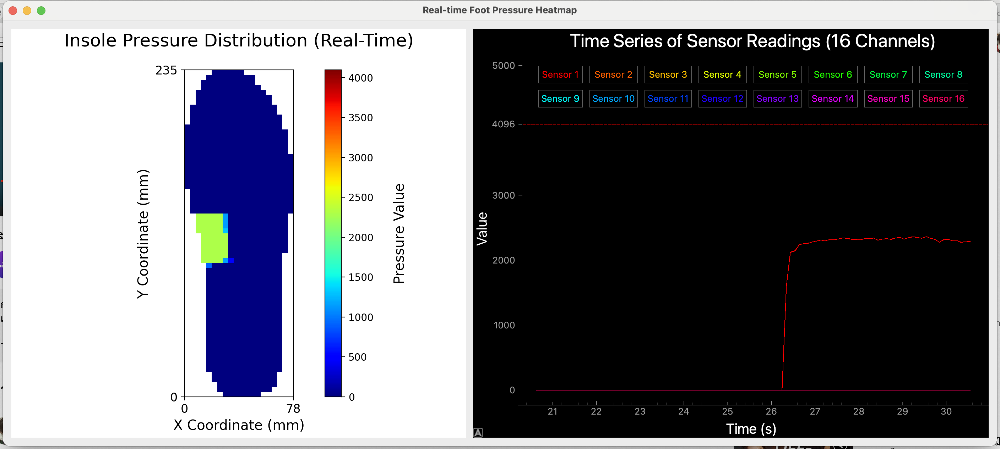

# FS-INS-16Z insole sensor manual

Instructions for setting up the hardware and software of the FS-INS-16Z insole sensor to transmit data to another computer, along with testing procedures and visualization.

**Table of content:**

1. [Hardware Setup](#Hardware-setup)
    - [Required Equipment](#required-equipment)
    - [Connecting the Insole to the PCB](#connecting-the-insole-to-the-pcb)
2. [Software Setup](#software-setup)
    - [Publisher code](#publisher-code)
    - [Subscriber code](#subscriber-code)
    - [visualization](#visualization)
3. [Testing program](#testing-program)
4. [Future work](#future-work)

## Hardware Setup

### Required Equipment

- FS-INS-16Z Insole Sensor
- Coustom PCB

>**Note:** The detailed schematic of the PCB is available in the provided EasyEDA Pro file.

### Connecting the Insole to the PCB

To connect the insole to the custom PCB, follow these steps:

1. Identify the correct insole (L for left, R for right)



2. Align the insole's FFC/FPC connector with the matching label on the PCB.
3. Insert insole to connector securely.

Refer to the image below:


>**Note:** To avoid potential damage or malfunction, minimize the number of times you connect and disconnect the insole from the connector, and make sure to insert the connector correctly each time.

## Software Setup

In this work, we will use MQTT protocol for sending data from insole to another computer.

### Publisher code

1. Download and open **Insole_FSR-INS-16Z.ino**
3. Connect the PCB to your computer via USB.
4. Select the correct board and port in your IDE.
5. Upload the publisher code to the PCB.

### Subscriber code

1. Download and open **mycom_sub.py**
2. Run the subscriber code on your computer.
3. Verify that the data is being received from the insole sensor through the PCB.

Here is the result of what you should see

```
[0, 0, 0, 0, 0, 0, 0, 0, 0, 0, 0, 0, 0, 0, 0, 0, 1724923390.480529, 7385]
[0, 0, 0, 0, 0, 0, 0, 0, 0, 0, 0, 0, 0, 0, 0, 0, 1724923390.490545, 7386]
[0, 0, 0, 0, 0, 0, 0, 0, 0, 0, 0, 0, 0, 0, 0, 0, 1724923390.500559, 7387]
[0, 0, 0, 0, 0, 0, 0, 0, 0, 0, 0, 0, 0, 0, 0, 0, 1724923390.510577, 7388]
[0, 0, 0, 0, 0, 0, 0, 0, 0, 0, 0, 0, 0, 0, 0, 0, 1724923390.520592, 7389]
[0, 0, 0, 0, 0, 0, 0, 0, 0, 0, 0, 0, 0, 0, 0, 0, 1724923390.530664, 7390]
[0, 0, 0, 0, 0, 0, 0, 0, 0, 0, 0, 0, 0, 0, 0, 0, 1724923390.540626, 7391]
[0, 0, 0, 0, 0, 0, 0, 0, 0, 0, 0, 0, 0, 0, 0, 0, 1724923390.550644, 7392]
[0, 0, 0, 0, 0, 0, 0, 0, 0, 0, 0, 0, 0, 0, 0, 0, 1724923390.560657, 7393]
[0, 0, 0, 0, 0, 0, 0, 0, 0, 0, 0, 0, 0, 0, 0, 0, 1724923390.570675, 7394]
[0, 0, 0, 0, 0, 0, 0, 0, 0, 0, 0, 0, 0, 0, 0, 0, 1724923390.580689, 7395]
```

or

```
{'count': 804, 'ts': '1724924394.166489', 'data': [0, 0, 0, 0, 0, 0, 0, 0, 0, 0, 0, 0, 0, 0, 0, 0]}
{'count': 805, 'ts': '1724924394.182449', 'data': [0, 0, 0, 0, 0, 0, 0, 0, 0, 0, 0, 0, 0, 0, 0, 0]}
{'count': 806, 'ts': '1724924394.198402', 'data': [0, 0, 0, 0, 0, 0, 0, 0, 0, 0, 0, 0, 0, 0, 0, 0]}
{'count': 807, 'ts': '1724924394.214338', 'data': [0, 0, 0, 0, 0, 0, 0, 0, 0, 0, 0, 0, 0, 0, 0, 0]}
{'count': 808, 'ts': '1724924394.230217', 'data': [0, 0, 0, 0, 0, 0, 0, 0, 0, 0, 0, 0, 0, 0, 0, 0]}
{'count': 809, 'ts': '1724924394.246050', 'data': [0, 0, 0, 0, 0, 0, 0, 0, 0, 0, 0, 0, 0, 0, 0, 0]}
{'count': 810, 'ts': '1724924394.261900', 'data': [0, 0, 0, 0, 0, 0, 0, 0, 0, 0, 0, 0, 0, 0, 0, 0]}
{'count': 811, 'ts': '1724924394.277805', 'data': [0, 0, 0, 0, 0, 0, 0, 0, 0, 0, 0, 0, 0, 0, 0, 0]}
{'count': 812, 'ts': '1724924394.293747', 'data': [0, 0, 0, 0, 0, 0, 0, 0, 0, 0, 0, 0, 0, 0, 0, 0]}
{'count': 813, 'ts': '1724924394.309587', 'data': [0, 0, 0, 0, 0, 0, 0, 0, 0, 0, 0, 0, 0, 0, 0, 0]}
{'count': 814, 'ts': '1724924394.325462', 'data': [0, 0, 0, 0, 0, 0, 0, 0, 0, 0, 0, 0, 0, 0, 0, 0]}
```
This view depends on the format you want, the above for visualization the below for sending to central com and testing

>**Note:** If you do not see any data, ensure that your MQTT broker is functioning correctly. If you are using the central computer as a subscriber, you do not need to download this part, but make sure to update the IP address.

### Visualization

1. Download and open **visual.py**
2. Run the visualization code on your computer.

This is what you should see



<div style="text-align: center;">
  <video width="800" height="450" controls>
    <source src="Fig/visual.mov" type="video/mp4">
    Your browser does not support the video tag.
  </video>
</div>


>**Note:** All of codes can be adjust for more functionality.

 
## Testing program

This is for testing the accuracy of message sending by counting the number of the received messages and sending messages ,and calculate the loss percentage of the sending data here is the steps:

1. Download and open **verifycount.py**
2. Run the code on your computer.
3. Enter the number of messages you plan to send.

The program will count the received messages and show you the loss percentage, which should look like this:

```
Total num: 360000
Missing counts: [4641, 4680, 4778, 4844, 9468, 11311, 11312, 11313, 11653, 12386, 12387, 13741, 15107, 15108, 15109, 15135, 16216, 18809, 20424, 22176, 23687, 25571, 26971, 26972, 26973, 26974, 26975, 26976, 28827, 62265, 78614, 100020, 100021, 100022, 100105, 166352, 167853, 168041, 207716, 222150, 222151, 222152, 222153, 222154, 222155, 222156, 222157, 222158, 222159, 222160, 222161, 222162, 222163, 222164, 222165, 222166, 222167, 222168, 222169, 222170, 222171, 222172, 222173, 222174, 222175, 222176, 222177, 222178, 222179, 222180, 222181, 222182, 232014, 289518, 297413, 342586, 342587, 342588, 342589, 342590, 342591, 342592, 342593, 342594, 342595, 342596, 342597, 342598, 342599, 342600, 342601, 342602, 342603, 342604, 342605, 342606, 342607, 342608, 342609, 342610, 342611, 342612, 342613, 342614, 342615, 342616, 342617, 342618, 342619]
Total number of messages: 359853
Loss percentage: 0.04083333333333439 %
```

## Future work

 - Make a cover of microcontroller for safety
 - Add the visualization of IMU
 - Calibrate the insole
 - Use it in real gait analysis research
